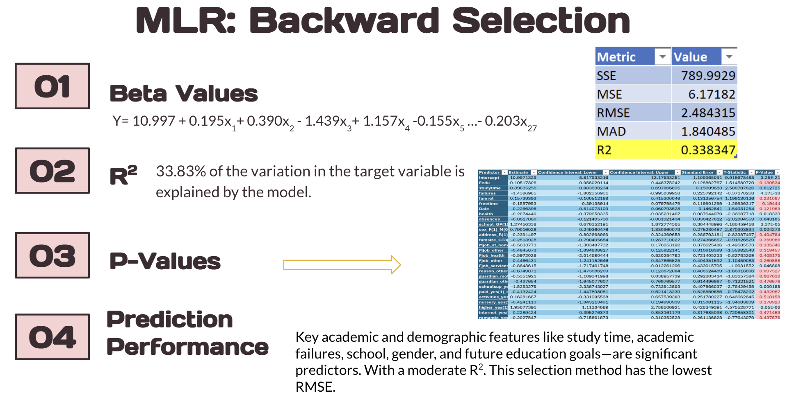

# Project Background
This Student Performance Prediction project analyzes academic data collected from two Portuguese secondary schools, originally published on the UCI Machine Learning Repository. The dataset includes student grades, demographic information, and social and school-related factors gathered via school reports and questionnaires.

The primary objective of this project is to explore which factors influence academic outcomes and to build predictive models that can help forecast student performance. This analysis has important implications for educators, policymakers, and support staff aiming to improve educational outcomes.

This project uses statistical analysis and machine learning techniques to uncover actionable insights and trends in student behavior and achievement.
## Insights and analysis were conducted across the following key areas:
- **Academic Performance Modeling:**
Use of Multiple Linear Regression (MLR), k-Nearest Neighbors (kNN), and Regression Trees to predict final grades (G3).
- **Feature Significance:**
Identification of important factors such as study time, parental education, academic failures, internet access, and aspirations for higher education.
- **Data Preprocessing & Cleaning:**
Handling outliers, converting categorical variables, checking correlation, and applying dummy encoding.
- **Model Evaluation:**
Comparative analysis of different model performances based on R² values, RMSE, and prediction accuracy.
- **Research Comparisons:**
Benchmarked against existing academic studies using similar datasets and methods.

The original dataset from UCI Machine Learning Repository can be found [here](https://archive.ics.uci.edu/dataset/320/student+performance)

The Google Sheets file can be accessed [here](https://docs.google.com/spreadsheets/d/1eTmDHrfbaTmuqp3KbAyYYeSISoHYKH3L/edit?usp=sharing&ouid=113841017042122709691&rtpof=true&sd=true)

## Dataset Information
**Data Preprocessing:**
A heatmap was created using the dataset in order to find correlations

Histograms of G1 (first period grade), G2 (second period grade), and G3 (final non-cumulative grade) were made to find outliers, however, none we're found and grade results of 0 are seen to be possible.

## Models Used
**Multiple Linear Regression:**

`Forward Selection` was used for MLR and Including G1 and 2 led to an extremely high R^2 and the goal was to be able to predict G3 without any knowledge of prior performance. Our GOAL: Predict the final grade of a student based on a student’s lifestyle, habits, and environment

`Beta Values` after selecting the best subset, which is selected through observing R2 and Mallow’s cp, were including beta values of fathers education, study time, failures, absences, school support, the sex, and if the student plans to pursue a higher education and an intercept of 7.66 (variables 6 through 8 in the equation use dummy variables 1 and 0) 

The R2 had a result of 0.2985, indicating that 29.85% of the variation in the target variable is explained by the model.

The P-Values displayed are predictors that are statistically significant, as we used forward selection to select best subset of variables

The model provides some predictive value, is statistically valid, and gives directional insights. This could include more contributing variables. However, it is not highly accurate for precise prediction.

`Stepwise Selection` had similar results to forward selection. When looking at the `Beta Values` we have the same variables selected as compared to the forward selection. The linear regression equation includes the beta values for the variables selected after clicking best subset. The noticeable difference would be the intercept of 7.659
R2: The r2 is 0.2985 suggesting, 29.85% of the variance in the outcome is explained by the model.
P-values:The p-values displayed are predictors that are statistically significant, as we used forward selection to select best subset of variables and present how these variables have an effect towards the outcome
Prediction Performance: The model has moderate predictive power. The significant predictors are logically consistent with academic performance drivers like study time, academic failures, and educational aspirations.

Beta Values: after selecting the best subset there was noticeable difference in coefficients and there is an intercept of 10.99 , and 27 variables  that contribute to the linear regression equation. But it was consistent with the previous variables such as fathers education, failures, study time, etc.
P-Values: The p-values displayed the ones highlighted in red indicate they are not statistically significant and are higher than 0.05, some added variables in this model with a statistically significant p-values include geological address/ location, relationship status, and health status. 
R2
Predictive Performance: Key academic and demographic features like study time, academic failures, school, gender, and future education goals—are significant predictors. With a moderate R2. However, this selection method has the lowest RMSE. This would be the best selection method as it also has a higher R2 given more selected variables.

**K-Nearest-Neighbors:**
- Tuned with screened variables
- Best R² ≈ 29%
  
**Decision Trees:**
- Pruned for best accuracy
- Variables: failures, higher education plans, absences, school type

## Key Findings
- Early grades (G1 & G2) are strong predictors
- Study time, internet access, and parental education matters
- Social outings and alcohol use can negatively impact performance

## Tools Used
- Excel / XLMiner
- R (for model comparison)
- Python (referenvced in comparison studies
## Limitations
- Few strong continuous predictors
- Overlap between variables (e.g., guardianship statuts)
- G1, G2, G3 not always clearly defined
## Future Work
- Include more behavioral and psychological predictors
- Use real-world or international datasets
- Explore classification models (e.g., pass/fail)
