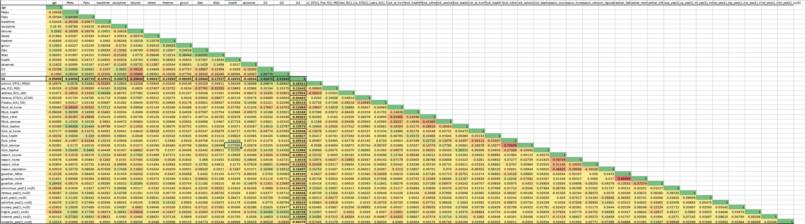
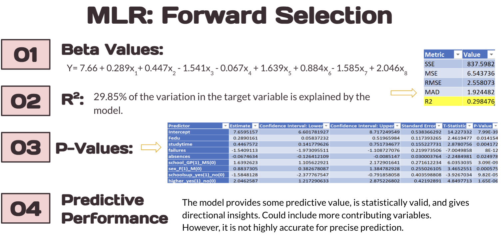

# Project Background
This Student Performance Prediction project analyzes academic data collected from two Portuguese secondary schools, originally published on the UCI Machine Learning Repository. The dataset includes student grades, demographic information, and social and school-related factors gathered via school reports and questionnaires.

The primary objective of this project is to explore which factors influence academic outcomes and to build predictive models that can help forecast student performance. This analysis has important implications for educators, policymakers, and support staff aiming to improve educational outcomes.

This project uses statistical analysis and machine learning techniques to uncover actionable insights and trends in student behavior and achievement.
## Insights and analysis were conducted across the following key areas:
- **Academic Performance Modeling:**
Use of Multiple Linear Regression (MLR), k-Nearest Neighbors (kNN), and Regression Trees to predict final grades (G3).
- **Feature Significance:**
Identification of important factors such as study time, parental education, academic failures, internet access, and aspirations for higher education.
- **Data Preprocessing & Cleaning:**
Handling outliers, converting categorical variables, checking correlation, and applying dummy encoding.
- **Model Evaluation:**
Comparative analysis of different model performances based on R² values, RMSE, and prediction accuracy.
- **Research Comparisons:**
Benchmarked against existing academic studies using similar datasets and methods.

The original dataset from UCI Machine Learning Repository can be found [here](https://archive.ics.uci.edu/dataset/320/student+performance)

The Google Sheets file can be accessed [here](https://docs.google.com/spreadsheets/d/1eTmDHrfbaTmuqp3KbAyYYeSISoHYKH3L/edit?usp=sharing&ouid=113841017042122709691&rtpof=true&sd=true)

## Dataset Information
**Data Preprocessing:**
A heatmap was created using the dataset in order to find correlations



Histograms of G1 (first period grade), G2 (second period grade), and G3 (final non-cumulative grade) were made to find outliers, however, none we're found and grade results of 0 are seen to be possible.

## Models Used
**Multiple Linear Regression:**
- Forward, Backward & Stepwise Selection
- R² up to 33.83%

  
| Beta Values | R-Squared | P-Values |
| --- | --- | --- |
| Y= 7.66 + 0.289x1+ 0.447x2 - 1.541x3 - 0.067x4 + 1.639x5 + 0.884x6- 1.585x7 + 2.046x8
  |  29.85% of the variation in the target variable is explained by the model.
 | ... |
- `example`
```
def hello_world(): print ("Hello, World!")
```
  
**K-Nearest-Neighbors:**
- Tuned with screened variables
- Best R² ≈ 29%
  
**Decision Trees:**
- Pruned for best accuracy
- Variables: failures, higher education plans, absences, school type

## Key Findings
- Early grades (G1 & G2) are strong predictors
- Study time, internet access, and parental education matters
- Social outings and alcohol use can negatively impact performance

## Tools Used
- Excel / XLMiner
- R (for model comparison)
- Python (referenvced in comparison studies
## Limitations
- Few strong continuous predictors
- Overlap between variables (e.g., guardianship statuts)
- G1, G2, G3 not always clearly defined
## Future Work
- Include more behavioral and psychological predictors
- Use real-world or international datasets
- Explore classification models (e.g., pass/fail)
