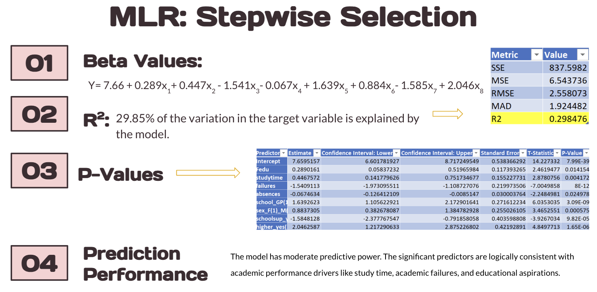
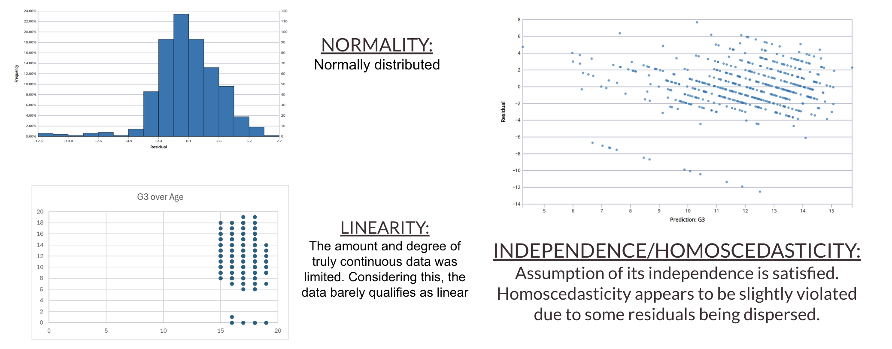
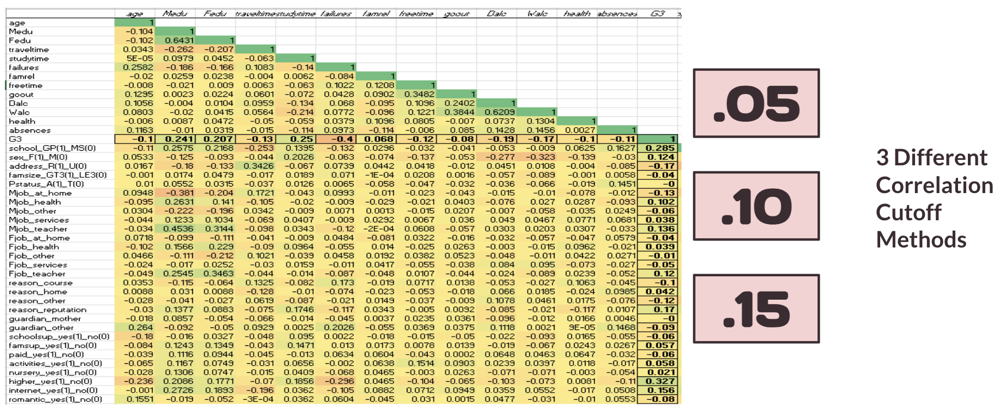
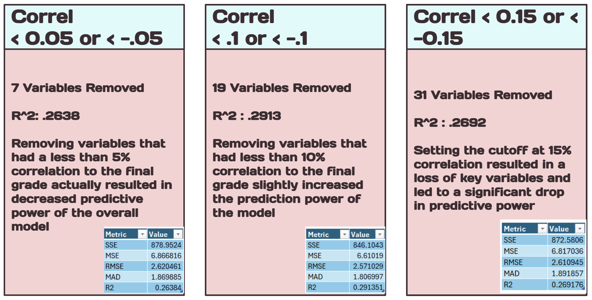
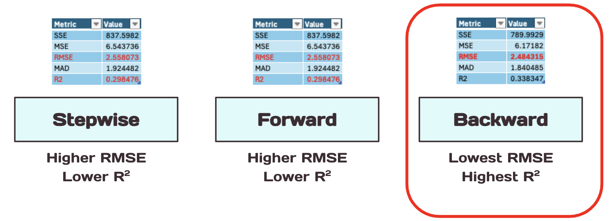
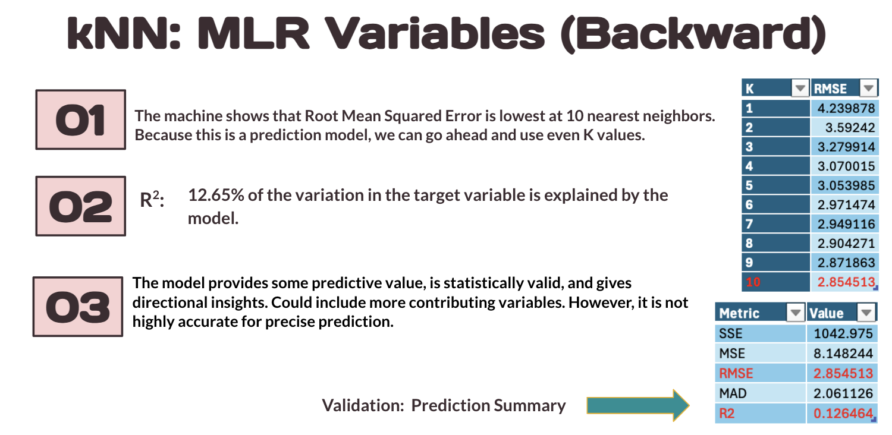
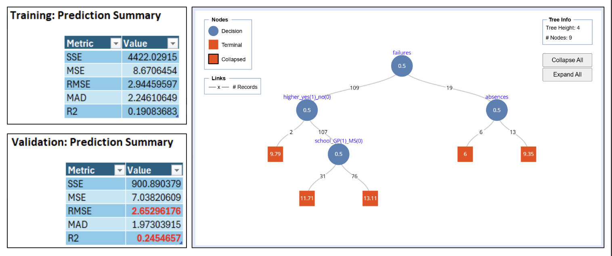
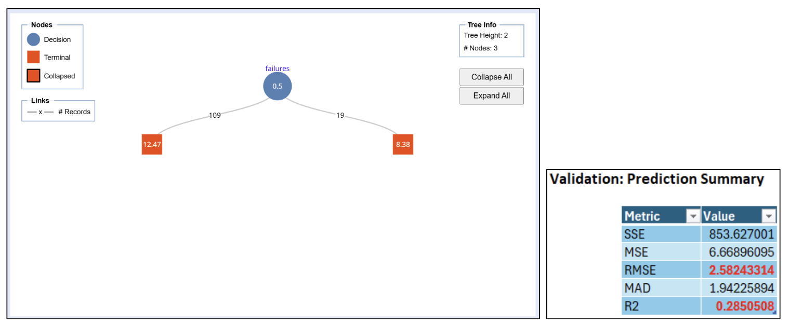

# Project Background
This Student Performance Prediction project analyzes academic data collected from two Portuguese secondary schools, originally published on the UCI Machine Learning Repository. The dataset includes student grades, demographic information, and social and school-related factors gathered via school reports and questionnaires.

The primary objective of this project is to explore which factors influence academic outcomes and to build predictive models that can help forecast student performance. This analysis has important implications for educators, policymakers, and support staff aiming to improve educational outcomes.

This project uses statistical analysis and machine learning techniques to uncover actionable insights and trends in student behavior and achievement.
## Insights and analysis were conducted across the following key areas:
- **Academic Performance Modeling:**
Use of Multiple Linear Regression (MLR), k-Nearest Neighbors (kNN), and Regression Trees to identify the most significant factors regarding final grades (G3).
- **Feature Significance:**
Identification of important factors such as study time, parental education, academic failures, internet access, and aspirations for higher education.
- **Data Preprocessing & Cleaning:**
Handling outliers, converting categorical variables, checking correlation, and applying dummy encoding.
- **Model Evaluation:**
Comparative analysis of different model performances based on R² values, RMSE, and prediction accuracy.
- **Research Comparisons:**
Benchmarked against existing academic studies using similar datasets and methods.

The original dataset from UCI Machine Learning Repository can be found [here](https://archive.ics.uci.edu/dataset/320/student+performance)

Our Google Sheets file can be accessed [here](https://docs.google.com/spreadsheets/d/1eTmDHrfbaTmuqp3KbAyYYeSISoHYKH3L/edit?usp=sharing&ouid=113841017042122709691&rtpof=true&sd=true)

## Dataset Information
**Data Preprocessing:**
A heatmap was created using the dataset in order to find correlations

Histograms of G1 (first period grade), G2 (second period grade), and G3 (final non-cumulative grade) were made to find outliers, however, none we're found and grade results of 0 are seen to be possible.

## Models Used
**Multiple Linear Regression:**

`Forward Selection` was used for MLR and Including G1 and G2 led to an extremely high R² and the goal was to be able to predict G3 without any knowledge of prior performance. Our goal in particular was to predict the final grade of a student based on a student’s lifestyle, habits, and environment

`Beta Values` after selecting the best subset, which is selected through observing R² and Mallow’s cp, were including beta values of fathers education, study time, failures, absences, school support, the sex, and if the student plans to pursue a higher education and an intercept of 7.66 (variables 6 through 8 in the equation use dummy variables 1 and 0) 

The R2 had a result of 0.2985, indicating that 29.85% of the variation in the target variable is explained by the model.

The P-Values displayed are predictors that are statistically significant, as we used forward selection to select best subset of variables

The model provides some predictive value, is statistically valid, and gives directional insights. This could include more contributing variables. However, it is not highly accurate for precise prediction.

`Stepwise Selection` had similar results to forward selection. When looking at the `Beta Values` we have the same variables selected as compared to the forward selection. The linear regression equation includes the beta values for the variables selected after clicking best subset. The noticeable difference would be the intercept of 7.659
The R² is 0.2985 suggesting, 29.85% of the variance in the outcome is explained by the model.

The `P-Values` displayed are predictors that are statistically significant, as we used forward selection to select best subset of variables and present how these variables have an effect towards the outcome.
The model has moderate predictive power. The significant predictors are logically consistent with academic performance drivers like study time, academic failures, and educational aspirations.

The `Beta Values` for `Backward Selection` after selecting had a noticeable difference in coefficients and an intercept of 10.99 and 27 variables that contribute to the linear regression equation. But it was consistent with the previous variables: fathers education, failures and study time.
The `P-Values` displayed the ones highlighted in red indicate they are not statistically significant and are higher than 0.05, some added variables in this model with a statistically significant p-values include geological address/ location, relationship status, and health status.

Key academic and demographic features like study time, academic failures, school, gender, and future education goals are significant predictors. This selection method has the lowest `RMSE` and a moderate R². This would be the best selection method as it also has a higher R² given more selected variables.

`Stepwise Selection` had similar results to forward selection. The key differences were the `beta values` had the same variables selected as compared to the forward selection. The linear regression equation includes the beta values for the variables selected after clicking best subset. The noticeable difference would be the intercept of 7.659

The `R²` is 0.2985 suggesting, 29.85% of the variance in the outcome is explained by the model.
The `P-Values` displayed are predictors that are statistically significant, as we used forward selection to select best subset of variables and present how these variables have an effect towards the outcome
The model has **moderate predictive power**. The significant predictors are logically consistent with academic performance drivers like study time, academic failures, and educational aspirations.

**Checking Assumptions**

Now that we selected backwards selection due to analyzing the summary of data and having lowest RMSE. The histogram of residuals suggests that they are normally distributed. We continued to check assumptions. The scatter plot  is of the residuals over fitted grade, it suggests that the independence assumption is met, as residuals are randomly scattered. However, homoscedasticity is violated, with residual variance decreasing as predicted values increase, indicating potential issues with unequal error spread.

**K-Nearest-Neighbors: Screened Variables**
- Tuned with `screened variables` and three seperate correlation cutoff values.
- Best R² ≈ 29%

**K-Nearest-Neighbors: MLR Selection**  
- `Backward Selection ` is chosen for kNN as the most effective model with a R² of .3383
- Outperforming both stepwise and forward models in fit and prediction accuracy.

**Regression Trees: Best Pruned Tree**

Pruned for **best accuracy**
- `Parameters`: Standard XLMiner parameters used (Maximum number of levels = 7).
- `Limits`: No additional limits were placed because sample size is small.
- `Variables`: Failures, higher educatuion plans, absences, and school GPA.

- `Abnormality`: R² is **higher** on validation than on training. RMSE is **lower** on validation than on training.
- `Interpretation`:

Left branch of failures (no failures)
Left branch of higher (no higher education, 0) → G3 = 9.79
Right branch of higher (yes higher education)
Left branch of school (school MS - Mousinho da Silveira, 0) → G3 = 11.71 
Right branch of school (school GP - Gabriel Pereira, 1) → G3 = 13.11
Right branch of failures (more than 1 failure)
Left branch of absences (no absences, 0) → G3 = 6 
Right branch of absences (one or more absence, 1) → G3 = 9.35 

**Regression Trees: Minimum Error Tree**
Pruned to have the **lowest error rate**
- `Parameters`: Standard XLMiner parameters used (Maximum number of levels = 7).
- `Limits`: No additional limits were placed because sample size is small.
- `Variables`: Failures.

**Camparisons Considered**

Three seperate student performance prediction studies were considered to compare our results.
- [Study #1](https://rpubs.com/Shuhxian123/1137519)
- [Study #2](https://rpubs.com/krithiha/709739)
- [Study #3](https://medium.com/@brianhulela/using-k-nearest-neighbors-for-student-performance-regression-fd5c58155c06)

The results of the three studies are consistent with our original study, while considering each respective discrepency and similarities.

## Key Findings
- Early grades (G1 & G2) are strong predictors.
- MLR, Regression Trees, and kNN using Backward MLR or kNN with screened variables (-.1/.1) lead to our best models.
- Study time, internet access, and parental education level matters.
- Social outings and alcohol use can negatively impact performance (parental social behavior are significant factors).
## Tools Used
- Excel / XLMiner
- R (for model comparison)
- Python (referenvced in comparison studies
## Limitations
- Few strong continuous predictors.
- Overlap between variables (e.g., guardianship status).
- G1, G2, G3 are not always clearly defined.
## Future Work
- **Include more behavioral and psychological predictors**
- **Use real-world or international datasets**
- **Explore classification models (e.g., pass/fail)**
- Although our model performed moderately well within this dataset, it’s essential to test whether it works in other settings. This is where external validation comes in. By applying the model to new data whether from another school, region, or even year, we check if its predictive power performs well and appropriately.
This helps us determine if the factors we’ve identified are genuinely impactful or just specific to this sample.
- To address unresolved questions, include additional predictors
- These relevant predictors could look like psychological and behavioral factors such as providing stress levels. Sleep patterns and average screen time per day can be insightful to a student’s performance. Socioeconomic details, although we were provided variables regarding family and parents occupations, could be insightful to be provided with household income amount.
